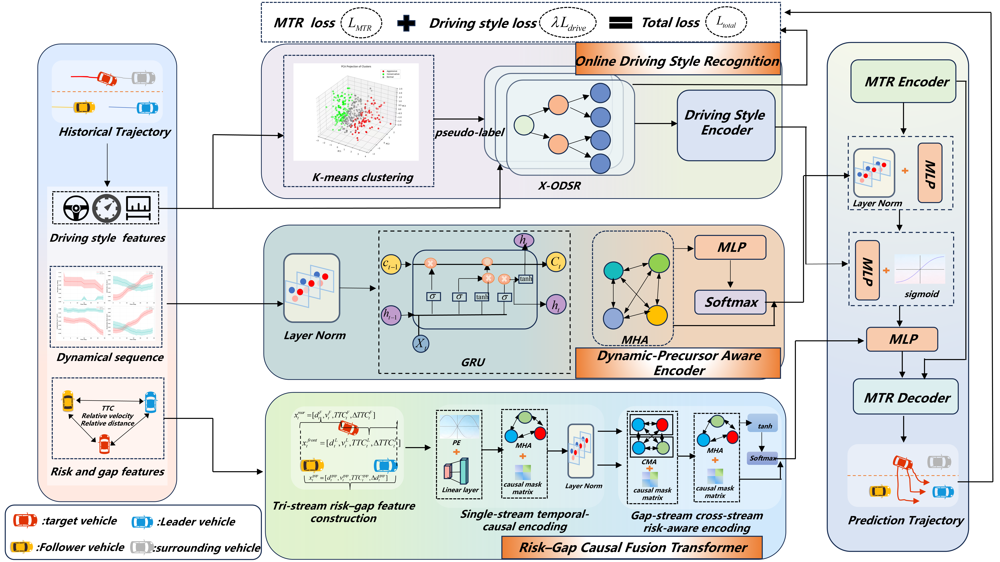

# Gap-Constrained-Interaction-Trajectory-Prediction-for-Highway-Cut-in-Considering-Driving-Styles
Official implementation of GC-StyleTP for highway cut-in trajectory prediction with driving-style priors and risk-gap causal fusion.
GC-StyleTP is a trajectory prediction framework for highway cut-in scenarios. The method models cut-in behavior from a gap-constrained interaction perspective and incorporates driving-style priors, dynamic precursor cues, and risk-gap causal fusion into a Motion Transformer based prediction framework.
## Framework

## Code Availability

This repository is associated with our manuscript submitted to *Transportation Research Part C: Emerging Technologies*. The source code, data preprocessing scripts, model configuration files, and reproduction instructions are currently being organized.

The full implementation will be publicly released upon acceptance of the manuscript.

## Acknowledgements

This project builds upon the [Motion Transformer (MTR)](https://github.com/sshaoshuai/MTR) framework. We sincerely thank the authors of MTR for releasing their implementation and providing a strong foundation for motion prediction research.

We also thank the contributors and maintainers of the open-source libraries used in this project.
